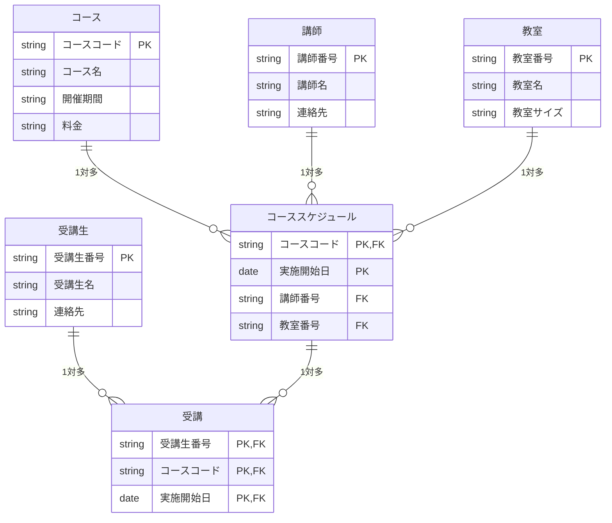
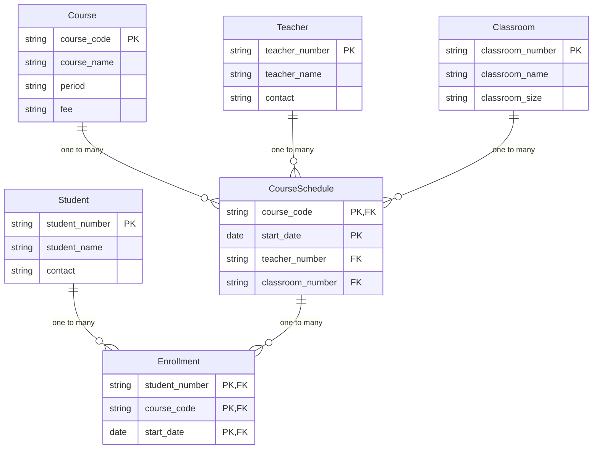

# 2026-05-19 数据库设计笔记

## 中文

本周继续学习数据库设计，重点是根据业务内容制作 ER 图。课堂内容从「如何发现实体」开始，说明了通过业务分析、访谈内容和名词抽取来整理系统中需要管理的数据对象，再进一步确定属性、主键、外键和实体之间的关系。

### ER 图制作流程

1. 业务整理
   - 先从整体业务出发，使用自上而下的方法整理系统要管理的对象。
   - 通过业务说明、访谈记录和需求文档找出重要名词。
   - 这些名词中，长期保存并需要管理的对象通常可以成为实体。

2. 实体抽取
   - 实体是系统中独立管理的对象。
   - 例：コース、講師、受講生、教室、スケジュール。
   - 如果某个对象只是其他对象的说明信息，通常作为属性处理，而不是单独建表。

3. 属性整理
   - 属性是实体拥有的项目。
   - 例：コース有コースコード、コース名、料金。
   - 属性需要根据业务含义决定数据类型、是否允许空值，以及是否需要唯一。

4. 主键确定
   - 主键用于唯一识别一条记录。
   - 例：コースコード可以识别一个课程，受講生番号可以识别一个学生。
   - 如果一个字段不能唯一识别记录，可以使用复合主键。

5. 关系整理
   - 确认实体之间是一对一、一对多，还是多对多。
   - 多对多关系通常需要拆成中间表。
   - 中间表会同时保存两边实体的主键，并作为外键使用。

6. 外键设计
   - 外键用于连接相关表。
   - 例：スケジュール中的講師番号连接講師表，教室番号连接教室表。
   - 外键可以保证数据之间的对应关系，避免不存在的课程、讲师或教室被引用。

### 教育管理系统 ER 图整理

本次课题以教育管理系统为例，ER 图中包含以下实体：

| 实体 | 主键 | 主要属性 |
| --- | --- | --- |
| 講師 | 講師番号 | 講師名、電話番号 |
| コース | コースコード | コース名、料金 |
| 受講生 | 受講生番号 | 受講生名、電話番号 |
| 教室 | 教室番号 | 教室名、教室サイズ |
| スケジュール | コースコード + 実施開始日 | 講師番号、教室番号 |
| 受講 | 受講生番号 + コースコード + 実施開始日 | 受講生和スケジュール的对应关系 |

### 关系说明

- 一个講師可以负责多个スケジュール。
- 一个コース可以有多个スケジュール。
- 一个教室可以安排多个スケジュール。
- 一个受講生可以参加多个スケジュール。
- 一个スケジュール也可以有多个受講生参加。
- 因为受講生和スケジュール之间是多对多关系，所以需要使用「受講」作为关系表。

### 本周重点

- ER 图不是直接画表，而是先理解业务中的实体和关系。
- 从访谈或需求说明中抽取名词，是发现实体和属性的常用方法。
- 主键负责唯一识别记录，外键负责连接表之间的关系。
- 多对多关系不能直接放在两张表中，需要建立中间表。
- スケジュール使用「コースコード + 実施開始日」作为复合主键。
- 受講表用于连接受講生和スケジュール，因此包含多个 PK/FK 字段。

---

## 日本語

今週はデータベース設計の続きとして、業務内容から ER 図を作成する方法を学習しました。授業では、業務分析やインタビュー内容から名詞を抜き出し、管理対象となるエンティティ、属性、主キー、外部キー、リレーションシップを整理する流れを確認しました。

### ER 図作成の手順

1. 業務の洗い出し
   - トップダウンで業務全体を整理する。
   - 業務説明、インタビュー、要件資料から重要な名詞を抜き出す。
   - 長期的に保存・管理する対象はエンティティの候補になる。

2. エンティティの抽出
   - エンティティは、システムで独立して管理する対象である。
   - 例：コース、講師、受講生、教室、スケジュール。
   - 他の対象を説明するだけの項目は、エンティティではなく属性として扱う。

3. 属性の整理
   - 属性はエンティティが持つ項目である。
   - 例：コースにはコースコード、コース名、料金がある。
   - 属性ごとに、データ型、NULL 可否、一意性などを考える。

4. 主キーの決定
   - 主キーは 1 件のレコードを一意に識別するための項目である。
   - 例：コースコード、講師番号、受講生番号。
   - 1 つの項目で一意にできない場合は、複合主キーを使う。

5. リレーションシップの整理
   - エンティティ同士の関係が 1 対 1、1 対多、多対多のどれかを確認する。
   - 多対多の関係は、そのまま表にせず、中間表に分解する。
   - 中間表には、関係する表の主キーを外部キーとして持たせる。

6. 外部キーの設計
   - 外部キーは表同士を関連付ける項目である。
   - 例：スケジュールの講師番号は講師表、教室番号は教室表を参照する。
   - 外部キーにより、存在しない講師・教室・コースを参照することを防げる。

### 教育管理システムの ER 図

今回の課題では、教育管理システムを例として以下のエンティティを整理しました。

| エンティティ | 主キー | 主な属性 |
| --- | --- | --- |
| 講師 | 講師番号 | 講師名、電話番号 |
| コース | コースコード | コース名、料金 |
| 受講生 | 受講生番号 | 受講生名、電話番号 |
| 教室 | 教室番号 | 教室名、教室サイズ |
| スケジュール | コースコード + 実施開始日 | 講師番号、教室番号 |
| 受講 | 受講生番号 + コースコード + 実施開始日 | 受講生とスケジュールの対応 |

### 関係の整理

- 1 人の講師は複数のスケジュールを担当できる。
- 1 つのコースは複数のスケジュールを持てる。
- 1 つの教室には複数のスケジュールを割り当てられる。
- 1 人の受講生は複数のスケジュールを受講できる。
- 1 つのスケジュールには複数の受講生が参加できる。
- 受講生とスケジュールは多対多の関係なので、「受講」を中間表として作成する。

### 今週のポイント

- ER 図は表をいきなり作るのではなく、まず業務上の対象と関係を整理する。
- インタビューや要件説明から名詞を抜き出すことは、エンティティと属性を見つける基本的な方法である。
- 主キーはレコードを一意に識別し、外部キーは表同士の関係を表す。
- 多対多の関係は中間表で表現する。
- スケジュールは「コースコード + 実施開始日」を複合主キーとして管理する。
- 受講表は受講生とスケジュールを結ぶ関係表であり、複数の PK/FK を持つ。

---

## English

This week continued the topic of database design, focusing on how to create an ER diagram from business requirements. The class covered how to identify entities by analyzing business processes, extracting nouns from interviews or requirement descriptions, and then organizing attributes, primary keys, foreign keys, and relationships.

### ER Diagram Workflow

1. Analyze the business process.
   - Start from the overall business flow with a top-down approach.
   - Extract important nouns from interviews, business descriptions, and requirements.
   - Objects that need to be stored and managed over time become entity candidates.

2. Identify entities.
   - An entity is an object managed independently by the system.
   - Examples: course, teacher, student, classroom, schedule.
   - If an item only describes another object, it is usually treated as an attribute.

3. Define attributes.
   - Attributes are the data items owned by an entity.
   - Example: a course has a course code, course name, and fee.
   - For each attribute, consider its data type, nullability, and uniqueness.

4. Decide primary keys.
   - A primary key uniquely identifies one record.
   - Examples: course code, teacher number, student number.
   - If one column is not enough, a composite primary key can be used.

5. Define relationships.
   - Decide whether each relationship is one-to-one, one-to-many, or many-to-many.
   - Many-to-many relationships should be resolved with an intermediate table.
   - The intermediate table stores keys from both related tables as foreign keys.

6. Design foreign keys.
   - A foreign key connects related tables.
   - For example, teacher number and classroom number in the schedule table refer to the teacher and classroom tables.
   - Foreign keys help prevent references to non-existing records.

### Education Management System ER Diagram

The assignment ER diagram uses an education management system as the example.

| Entity | Primary Key | Main Attributes |
| --- | --- | --- |
| Teacher | Teacher number | Teacher name, phone number |
| Course | Course code | Course name, fee |
| Student | Student number | Student name, phone number |
| Classroom | Classroom number | Classroom name, classroom size |
| Schedule | Course code + start date | Teacher number, classroom number |
| Enrollment | Student number + course code + start date | Relationship between student and schedule |

### Relationship Summary

- One teacher can be assigned to many schedules.
- One course can have many schedules.
- One classroom can be used by many schedules.
- One student can attend many schedules.
- One schedule can have many students.
- Because students and schedules have a many-to-many relationship, the enrollment table is used as an intermediate table.

### Key Points

- An ER diagram starts from business objects and relationships, not directly from tables.
- Extracting nouns from interviews or requirements is a practical way to find entities and attributes.
- Primary keys identify records, while foreign keys connect related tables.
- Many-to-many relationships should be represented with an intermediate table.
- The schedule table uses a composite primary key: course code + start date.
- The enrollment table connects students and schedules and therefore contains multiple PK/FK columns.
